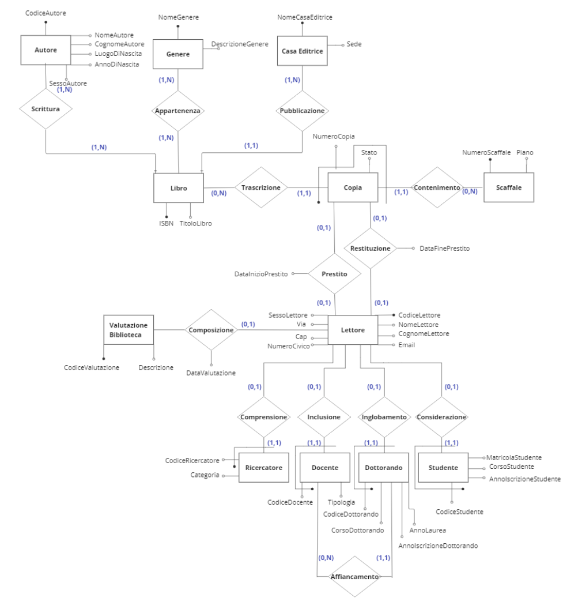

<h1 align="center">📚 Database Biblioteca Universitaria</h1>

Database relazionale progettato per la gestione di una biblioteca universitaria e implementato utilizzando MySQL.

Il progetto include le principali fasi della progettazione di una base di dati.

## 🧩 Fasi del progetto

### Analisi dei requisiti

- requisiti espressi in linguaggio naturale;
- glossario dei termini;
- strutturazione dei requisiti;
- specifica dei requisiti informativi e funzionali.

### Progettazione concettuale

- strategia Inside-out;
- creazione dello schema E-R;
- definizione delle generalizzazioni;
- dizionario dei dati;
- regole di vincolo e di derivazione.

### Progettazione logica

- ristrutturazione dello schema E-R;
- traduzione verso lo schema relazionale.

### Normalizzazione

- analisi delle dipendenze funzionali per ridurre ridondanze e anomalie.

### Progettazione fisica

- definizione di come lo schema logico verrà implementato nel DBMS scelto.

### Realizzazione

- implementazione in MySQL.

## 🔎 Interrogazioni SQL

- interrogazioni su singola tabella;
- interrogazioni con JOIN;
- interrogazioni con operatori aggregati;
- interrogazioni nidificate;
- interrogazioni con viste;
- interrogazioni con operatori insiemistici.

## 🗂️ Schema E-R



## 🛠️ Tecnologie utilizzate

- MySQL
- SQL

## 📂 Struttura del repository

```text
database-biblioteca/
│
├── README.md
│
├── sql/
│   └── bibliotecaDamiana.sql
│
├── docs/
│   ├── relazione-progetto.pdf
│   └── presentazione.pptx
│
└── screenshots/
    └── schema-er-finale.png

```

## 🚀 Sviluppi Futuri

Il progetto rappresenta la base dati di una possibile applicazione full stack dedicata alla gestione di una biblioteca universitaria.

Possibili evoluzioni future:

sviluppo di API REST per il backend;
autenticazione e gestione dei ruoli utente;
dashboard amministrativa per la gestione di libri, utenti e prestiti;
area utente per la consultazione del catalogo e la richiesta di prestiti;
gestione della disponibilità e dello storico dei prestiti;
frontend web responsive.

---

## 👩‍💻 Damiana Arangio

Progetto sviluppato e presentato in sede d’esame universitario.